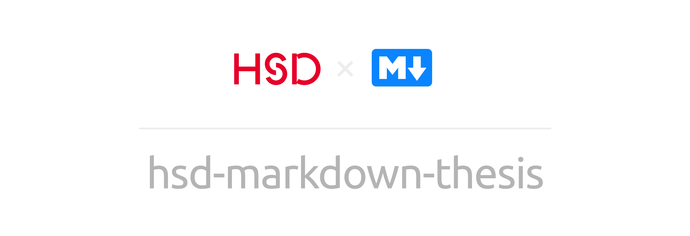

<p align="center">
  
</p>

Use the <a href="https://github.com/KuhlTime/hsd-markdown-thesis/generate"></a> Button to get started with your thesis.

> ⚠️😉 Don't be intimidated by the number of files you only really need to care about the `contents/` folder!

This template repository should get you quickly up and running with your thesis. It uses [pandoc](https://pandoc.org/) to compile all markdown files into a single PDF. The template is set up for a german 🇩🇪 paper but can be easily adapted to other languages.

<p align="center">
  <a href="https://hsd-markdown-thesis.vercel.app/output.pdf" target="_blank">
    
  </a>
</p>

**The example output can be viewed [here](https://hsd-markdown-thesis.vercel.app/output.pdf).**

I have created this repo because I didn't want to have the complexity of a LaTeX project, but still use most of the features provided by the LaTeX language.

The project includes:
- A GitHub Action that automatically generates a new PDF release every time you push to the `main` branch of this repository.
- Scripts to run the compilation locally.
- Support for BibTex.
- An API to give access to the generated release over a static url.

The Figma design for the cover (`static/beginning.pdf`) can be found here:<br>
https://www.figma.com/community/file/1037658856144320408/hsd-markdown-thesis

In case you are interested in a LaTeX Template visit ✌️:<br>
https://github.com/TimB87/HSD-LaTeX-Template

## Folder Structure

- `content/`: The folder where all the **markdown files** and **assets** are stored. It is important that the markdown files are sorted in the same way you want them to appear inside the final PDF file. I suggest you to use a new file for each chapter.
  - `00_meta.md`: This file contains some basic metadata as well as the location of the table of contents, the list of figures and the list of tables.
- `static/`: This directory contains all PDF files that should be added as they are. I have added a basic example PDF File to be used for the HSD.
  - `beginning.pdf`: This file gets prepended to the final PDF.
  - `end.pdf`: The file gets appended to the final PDF.
- `generate.sh`: Script to generate the PDF.
- `watch.sh`: Script that watches the content folder for changes and automatically generates the PDF on any change.
- `content.pdf`: The generated PDF content. The full document is currently only available through GitHub.
- `style.csl`: The citation style used for the PDF. I used a modified version of the IEEE standard 🇩🇪. [CSL](https://citationstyles.org/), [CSL Library - GitHub](https://github.com/citation-style-language/styles)
- `bibliography.bib`: This is the BibTex file that holds information about your citations. You can use any BibTex editor you want to generate this file. I have been using [MyBib](https://mybib.com/), which is an easy and beautifully designed web tool. (I am hoping for an API to make the PDF generation even easier.)

All other files are **not vital** to be known of.

## Edit on Gitpod

Once you created a copy from this template, you can head to [gitpod.io](https://gitpod.io) and create a workspace. All the required steps will be taken for you, and you will be presented with a fresh environment where you can immediately start being productive. All you have to do is to open and drag the `content.pdf` file into a new split pane.

## Setup Local Environment

> 🥳 If you just want to use the GitHub Action there is **no need to install anything!**

In order to compile the PDF locally you need to have the following installed:
- [pandoc](https://pandoc.org/)
- [when-changed](https://pypi.org/project/when-changed/)

### Font

In order to design your own cover, you need to download the official LaTeX font from: https://sourceforge.net/projects/cm-unicode/

### VSCode

I have added some extensions to go along with VSCode that should help you write more quickly.

### macOS

```sh
brew install pandoc python
```

### Linux (Ubuntu)

```sh
apt update
apt install pandoc python3-pip -y
```

### Windows

```sh
choco install pandoc pip
```

### All

**If** you want to use the `watch.sh` script you can install `when-changed` using:
```sh
pip install when-changed
```

### Execution

To execute the script you can use the following command:
```sh
./watch.sh
```

Or if you only want to run the generation once without listening for changes:
```sh
./generate.sh
```

## Deployment

### GitHub Actions
The GitHub Action will run automatically every time you push your changes to the `main` branch. After a couple of minutes, you will have a new release on your GitHub repository where you can download the generated PDF File.

### API (Optional)

The API provides easy access to the generated PDF File. You can use it to download the PDF File from your browser.

The repository is set up in a way that the API can easily be deployed to a free hosting provider called [Vercel](https://vercel.com/). Visit the Wiki page for more information.

[How to set up the Vercel API?](https://github.com/KuhlTime/hsd-markdown-thesis/wiki/Setup-Vercel)

## Cheat Sheet

Pandoc uses a more advanced form of markdown which allows for LaTeX statements to be directly included in your content. Some of the most useful expressions I have listed in the table below. If you are just looking for a standard markdown cheat sheet you can find it [here](https://guides.github.com/pdfs/markdown-cheatsheet-online.pdf).

| Command                | Function                                                                                                      |
| ---------------------- | ------------------------------------------------------------------------------------------------------------- |
| `\tableofcontents`     | Generates the table of contents based on the markdown headers you have defined.                               |
| `\listoftables`        | Creates a list of all tables and their location inside your work.                                             |
| `\listoffigures`       | Creates a list of all figures used inside your thesis.                                                        |
| `\setcounter{page}{1}` | When using this statement the page counter gets reset and changes all following page numbers.                 |
| `$<Expression>$`       | If you want to write a math expression use two `$` to denote the section where your expression is written in. |

## More Ressources

- [Hinweise zum wissenschaftlichen Arbeiten](https://soz-kult.hs-duesseldorf.de/studium/was/Documents/Hinweise%20zum%20wissenschaftlichen%20Arbeiten_September2020_Final.pdf): This is a good ressource on how to write good scientific papers. 🇩🇪 
- [Pandoc Markdown](https://www.flutterbys.com.au/stats/tut/tut17.3.html)

## Contributing / Questions

I am happy to accept any contribution. If you have any questions or suggestions feel free to open up a new issue. [New Issue](https://github.com/KuhlTime/hsd-markdown-thesis/issues/new)
