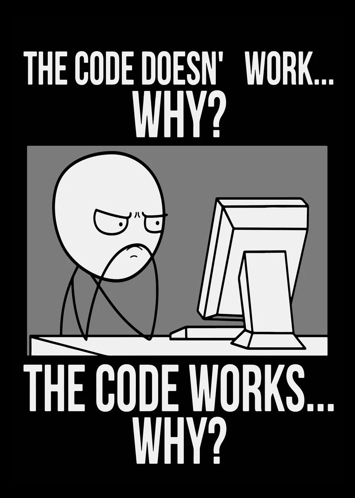

\setcounter{page}{1}
# Einleitung

## Mathematik

$f(x)=x^2$

## Zitate

Hier steht zitierter Text @simpson_2020_you

## Fußnote

Dies ist ein kompilzierte Passage^[Jetzt ist es einleuchtend].

## Bild

{ #fig:sample width=140px }

Abbildung @fig:sample zeigt ein Bild.

## Tabelle

| Teil       |   Wert |
| ---------- | -----: |
| Mehrheit   | $95\%$ |
| Minderheit |  $5\%$ |

Table: Es ist die Mehrheit.

## Code

```javascript
function saySomethingFunny() {
  console.log("Sometimes I believe the compiler ignores all my comments")
}
```

## Abkürzungen

> Die _(+HSD)_ wurde vor etwas mehr als 50 Jahren gegründet.

Es wird ein Plugin verwendet welches es euch erlaubt Glossar einträger vorzunehmen. Sämtlich Eintärge sind vorher in die `glossary.tex` Datei einzutragen. 

Mehr Infos dazu findet ihr unter [https://github.com/tomncooper/pandoc-gls](https://github.com/tomncooper/pandoc-gls)
